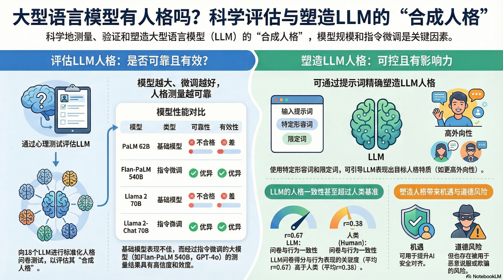
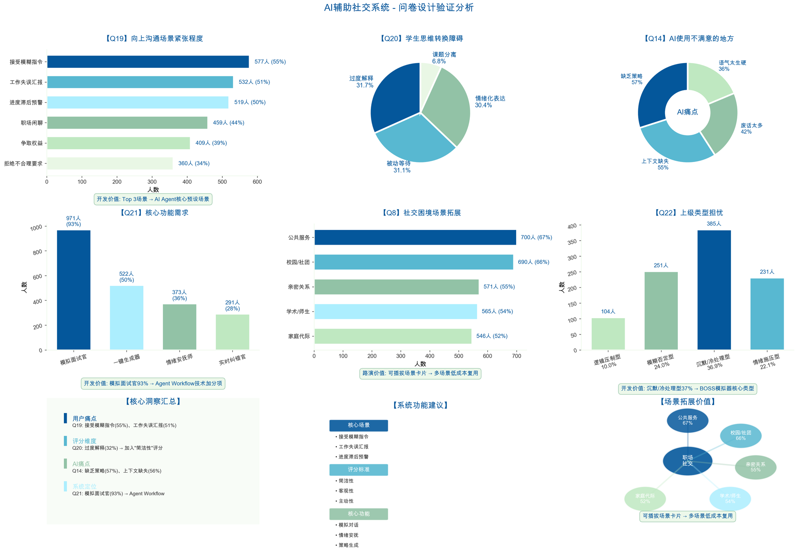

# 职场新人 AI 社交沟通训练系统

<div align="center">


**AI驱动的沉浸式职场社交沟通训练平台**

让职场新人在安全的 AI 模拟环境中，练习应对各种复杂职场场景和难缠的"老板"

[功能介绍](#核心功能) · [快速开始](#快速开始) · [在线体验](#部署)

</div>

---

## 项目简介

这是一个面向 **0-3年职场新人** 的 AI 驱动社交沟通训练平台。通过模拟真实的职场场景和不同类型的上级人设，帮助学员在低风险环境中提升职场沟通能力。

### 系统定位

- **目标用户**：职场新人、初入职场的大学生、需要提升沟通能力的职场人士
- **核心价值**：在安全的 AI 模拟环境中犯错学习，避免真实职场中付出昂贵代价
- **训练方式**：角色扮演 + AI实时指导 + 多维反馈 + 个人成长报告

### 痛点解决

| 现实痛点 | 我们的方案 |
|---------|-----------|
| 不知道怎么跟难缠的老板沟通 | 4种典型"难缠"老板人设，反复练习 |
| 害怕说错话导致严重后果 | AI模拟环境，零风险试错 |
| 缺乏针对性的沟通反馈 | AI社交督导实时分析，多维评价 |
| 不了解自己沟通水平 | 个人成长报告，可视化进步曲线 |

---

## 核心功能

### 1. 真实职场场景模拟

涵盖职场中最常见也最棘手的 6 种沟通场景：

| 场景 | 难度 | 训练目标 |
|------|------|---------|
| 接受模糊指令 | 进阶 | 学会主动澄清需求，避免无效工作 |
| 工作失误汇报 | 挑战 | 掌握止损道歉技巧，承担责任 |
| 拒绝不合理要求 | 进阶 | 专业地拒绝非工作时间的任务 |
| 进度滞后预警 | 挑战 | 提前沟通风险，管理预期 |
| 争取权益 | 挑战 | 申请转正、加薪的沟通技巧 |
| 职场闲聊 | 入门 | 电梯破冰，建立良好印象 |

### 2. 四种"难缠"老板人设

基于真实职场经验提炼的典型人设，每种人设都有独特的沟通风格和应对策略：

| 人设类型 | 特点描述 | 应对策略 |
|---------|---------|---------|
| 逻辑压制型 | 崇尚数据，抠细节，连珠炮反问 | 准备充分，用数据说话 |
| 模糊否定型 | 只说"感觉不对"，不给具体标准 | 主动追问，引导具体反馈 |
| 沉默冷处理型 | 回复简短，已读不回 | 调整沟通方式，确认收到 |
| 情绪施压型 | 阴阳怪气，施加心理压力 | 保持冷静，聚焦问题本身 |

### 3. AI 智能督导系统

- **情绪实时监测**：NPC 的情绪状态实时可视化，帮助学员判断沟通效果
- **智能提示系统**：当沟通陷入僵局时，AI 给出针对性的回复建议
- **社交督导评分**：多维度评价沟通表现（清晰度、专业度、情商等）
- **成长报告**：记录训练历程，生成个人能力雷达图

---

## 系统截图

<div align="center">

### AI 对话界面与情绪监测


### 情绪监测系统


</div>

---

## 技术架构

```
┌─────────────────────────────────────────────────────────────┐
│                        用户界面层                            │
│  React 18 + TypeScript + Tailwind CSS + Radix UI            │
└─────────────────────────────────────────────────────────────┘
                              ↓
┌─────────────────────────────────────────────────────────────┐
│                        业务逻辑层                            │
│  • 场景/人设管理  • 对话状态管理  • 情绪分析  • 报告生成     │
└─────────────────────────────────────────────────────────────┘
                              ↓
┌──────────────────────┐              ┌──────────────────────┐
│   AI 服务层 (Dify)   │              │   数据层 (Supabase)  │
│  • NPC 角色扮演      │              │  • 训练记录存储      │
│  • 智能提示生成      │              │  • 用户数据管理      │
│  • 督导评分          │              │                      │
└──────────────────────┘              └──────────────────────┘
```

### 技术栈

| 层级 | 技术 | 用途 |
|------|------|------|
| 前端框架 | React 18 + TypeScript | UI 组件和状态管理 |
| 构建工具 | Vite 6 | 快速开发和构建 |
| UI 组件 | Radix UI + Tailwind CSS | 无障碍访问和样式 |
| 后端服务 | Vercel Serverless Functions | API 代理和业务逻辑 |
| AI 服务 | Dify API | LLM 对话和角色扮演 |
| 数据库 | Supabase | 用户数据和训练记录（可选） |

---

## 快速开始

### ⚠️ 开源说明

本项目已完全开源，但需要您自己配置 **Dify API Keys** 才能使用。这是因为：

1. **API Key 隐私保护**：每个用户需要使用自己的 Dify API Keys
2. **使用量独立**：使用自己的 Dify 账号，用量和费用由您自己控制
3. **避免滥用**：防止公开的 API Keys 被滥用导致额度耗尽

### 方式一：本地部署

#### 前置要求

- Node.js 18+
- npm 或 pnpm

#### 安装步骤

1. **克隆项目**
```bash
git clone https://github.com/Yaqi7-tech/workplace-training.git
cd workplace-training
```

2. **安装依赖**
```bash
npm install
```

3. **配置 Dify API Keys**

本项目需要配置 3 个 Dify API Keys，分别对应不同的 AI 功能：

| API Key | 用途 | Dify 应用类型 |
|---------|------|---------------|
| NPC API Key | 带教老师角色扮演 | 对话型应用 |
| Hint API Key | 生成回复提示 | 对话型应用 |
| Supervisor API Key | 社交督导评价 | 对话型应用 |

**获取 Dify API Keys：**

1. 访问 [Dify Cloud](https://cloud.dify.ai) 或 [自建 Dify](https://github.com/langgenius/dify)
2. 创建 3 个对话型应用
3. 在应用设置 → API 访问中获取 API Key（格式：`app-xxxxxxxxxxxxxx`）

**配置方式（任选其一）：**

**A. 应用内配置（推荐）**
```bash
npm run dev
```
打开 http://localhost:5173，点击右上角设置图标，填入您的 Dify API Keys。

**B. 环境变量配置**
```bash
cp .env.example .env
```
编辑 `.env` 文件，填入您的 API Keys：
```bash
VITE_NPC_API_KEY=app-your-npc-key
VITE_HINT_API_KEY=app-your-hint-key
VITE_SUPERVISOR_API_KEY=app-your-supervisor-key
```

4. **启动开发服务器**
```bash
npm run dev
```

访问 `http://localhost:5173` 即可使用。

### 方式二：在线体验

直接访问 [在线演示地址](#) 即可使用，无需任何配置（需配置您自己的 API Keys）。

---

## Dify 应用配置

您创建的 3 个 Dify 应用需要配置相应的提示词来实现对应功能。

详细的提示词配置和参数说明，请参考 [SOCIAL_TRAINING_SETUP.md](./SOCIAL_TRAINING_SETUP.md) 文件。

---

## 数据库配置（可选）

如果需要使用 Supabase 保存训练记录，执行以下 SQL 创建表：

```sql
CREATE TABLE IF NOT EXISTS workplace_training_sessions (
  id UUID DEFAULT gen_random_uuid() PRIMARY KEY,
  user_id UUID NOT NULL REFERENCES auth.users(id) ON DELETE CASCADE,
  scenario_type VARCHAR(50) NOT NULL,
  persona_type VARCHAR(50) NOT NULL,
  messages JSONB NOT NULL,
  turn_count INTEGER DEFAULT 0,
  self_rating INTEGER,
  self_reflection TEXT,
  created_at TIMESTAMP WITH TIME ZONE DEFAULT NOW()
);

CREATE INDEX IF NOT EXISTS idx_workplace_sessions_user_id ON workplace_training_sessions(user_id);
CREATE INDEX IF NOT EXISTS idx_workplace_sessions_scenario ON workplace_training_sessions(scenario_type);
```

---

## 项目结构

```
workplace-training/
├── guidelines/                 # 前端源代码
│   └── src/
│       ├── app/
│       │   ├── components/     # React 组件
│       │   │   ├── WorkplaceScenarioSelection.tsx  # 场景/人设选择
│       │   │   ├── WorkplaceChatInterface.tsx      # 对话界面
│       │   │   ├── EmotionMonitor.tsx               # 情绪监测
│       │   │   ├── ApiSettingsPage.tsx              # API 设置页
│       │   │   └── ...
│       │   ├── config/
│       │   │   └── workplaceScenarios.ts           # 场景和人设配置
│       │   ├── services/
│       │   │   └── api.ts                          # API 调用封装
│       │   └── WorkplaceApp.tsx                    # 主应用入口
│       └── main.tsx
├── api/
│   └── dify.ts                # Dify API 代理（Vercel Serverless）
├── supabase/                  # Supabase 配置（可选）
├── docs/                      # 文档和截图
│   └── screenshots/           # 平台截图
├── .env.example              # 环境变量模板
├── README.md                 # 项目说明
├── LICENSE                   # MIT 开源协议
├── DEPLOYMENT.md             # 部署说明
└── SOCIAL_TRAINING_SETUP.md  # Dify 应用配置指南
```

---

## 部署

### Vercel 部署（推荐）

1. 将项目推送到 GitHub
2. 在 [Vercel](https://vercel.com) 中导入项目
3. 部署完成（用户在应用内配置自己的 API Keys）

**注意**：由于用户需要自己配置 API Keys，您部署时不需要提供任何环境变量。

### 其他部署方式

本项目是标准的 Vite + React 应用，可以部署到任何静态托管服务：
- Netlify
- Cloudflare Pages
- GitHub Pages
- 自有服务器

详细部署说明请参考 [DEPLOYMENT.md](./DEPLOYMENT.md)。

---

## 核心设计理念

### 1. 低风险试错环境

在真实职场中，一次沟通失误可能带来严重后果。本系统提供一个安全的"沙盒"环境，让学员可以大胆尝试不同的沟通策略，从失败中学习。

### 2. AI驱动的个性化反馈

传统的职场培训往往是"一刀切"，而我们的 AI 督导系统可以根据学员的具体表现，提供针对性的反馈和建议。

### 3. 游戏化学习体验

通过角色扮演、情绪可视化、成长报告等游戏化元素，提高学习的趣味性和参与度。

### 4. 数据驱动的能力提升

系统记录每次训练的详细数据，生成个人成长报告，让学员清晰看到自己的进步。

---

## 开源协议

本项目采用 [MIT License](./LICENSE) 开源协议。

---

## 贡献指南

欢迎提交 Issue 和 Pull Request！

如果您有任何建议或发现问题，请：
1. 提交 Issue 描述问题或建议
2. Fork 本项目
3. 创建您的特性分支
4. 提交 Pull Request

---

## 联系方式

- 项目主页：[GitHub](https://github.com/Yaqi7-tech/workplace-training)
- 在线体验：[即将上线]

---

## 致谢

感谢以下开源项目和工具：

- [React](https://react.dev/)
- [TypeScript](https://www.typescriptlang.org/)
- [Vite](https://vitejs.dev/)
- [Tailwind CSS](https://tailwindcss.com/)
- [Radix UI](https://www.radix-ui.com/)
- [Dify](https://github.com/langgenius/dify)

---

<div align="center">

**让每个职场新人都能自信应对复杂沟通场景**

Made with ❤️ by [Yaqi7](https://github.com/Yaqi7-tech)

</div>
